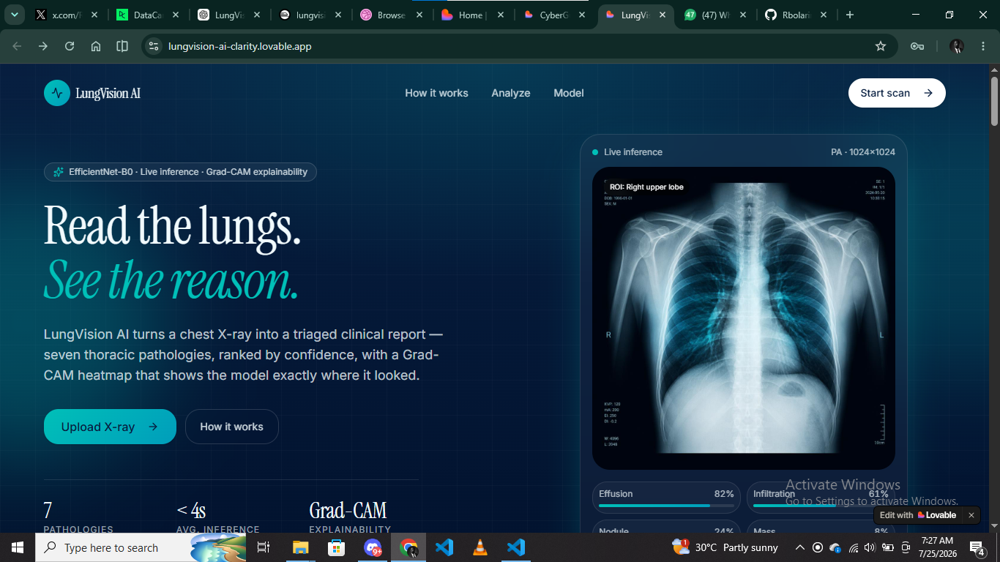
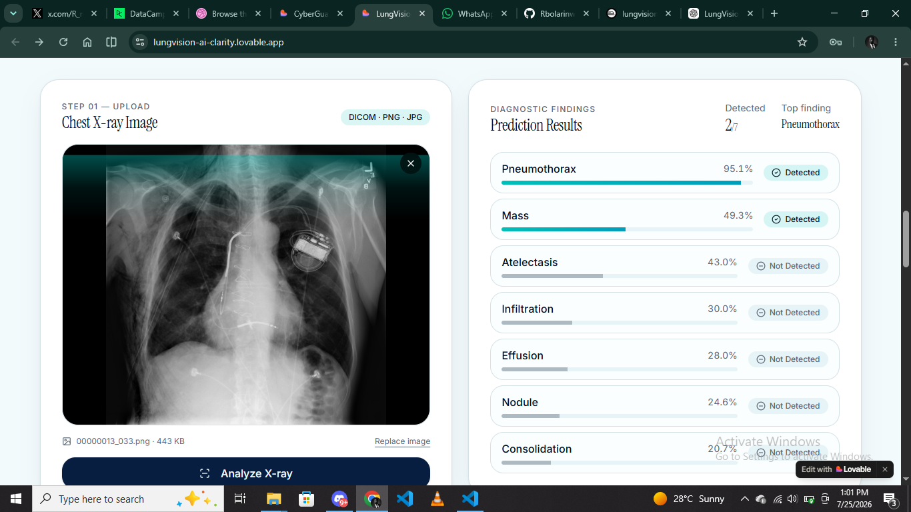
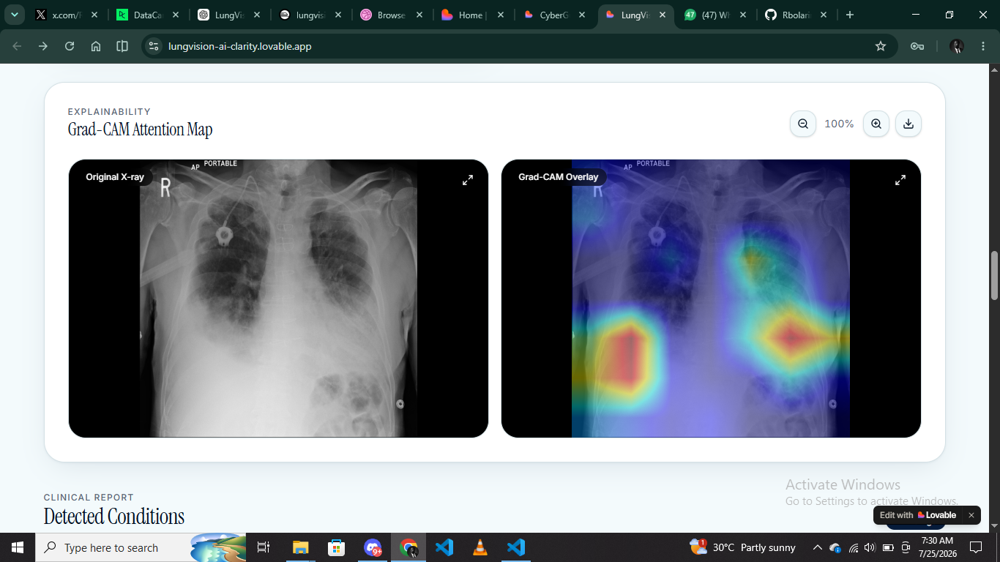
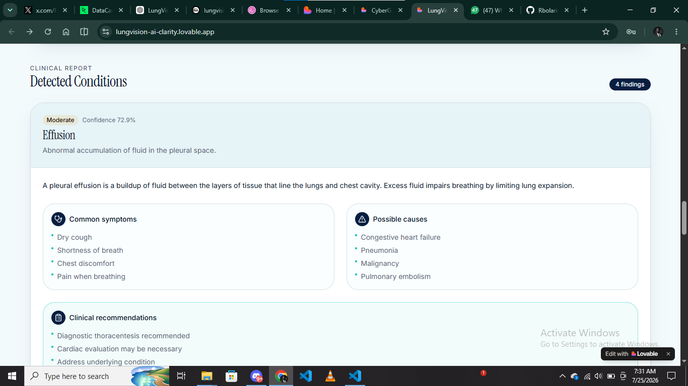

<p align="center">


# 🫁 LungVision AI

### AI-Powered Explainable Chest X-ray Disease Classification

Detect thoracic diseases from Chest X-rays using **EfficientNet-B0** and visualize AI predictions with **Grad-CAM Explainability**.

Built with **PyTorch**, **FastAPI**, **Docker**, **Railway**, and **Lovable**.

[🌐 Live Demo](https://lungvision-ai-clarity.lovable.app/) • [📖 API Docs](https://lungvision-ai-backend-production.up.railway.app/docs)

</p>

---

# 🎥 Live Demo

<p align="center">


</p>

---

# 📸 Application Preview

## 🏠 Landing Page

<p align="center">



</p>

---

## 🤖 AI Prediction Report

<p align="center">



</p>

---

## 🔥 Grad-CAM Explainability

<p align="center">



</p>

---

## Clinical report

<p align="center">



</p>

---

# 📖 Overview

LungVision AI is an end-to-end Deep Learning application that automatically analyzes Chest X-ray images to detect thoracic diseases while explaining every prediction using **Grad-CAM**.

The project demonstrates the complete Machine Learning lifecycle—from dataset preparation and model training to deployment through FastAPI, Docker, Railway, and a modern Lovable frontend.

---

# 🚀 Features

- 🧠 EfficientNet-B0 Transfer Learning
- 🔥 Explainable AI (Grad-CAM)
- 🩻 Detects **7 Thoracic Diseases**
- ⚡ FastAPI REST API
- 🐳 Dockerized Deployment
- ☁️ Railway Hosted Backend
- 💜 Modern Responsive UI
- 📱 Mobile Friendly
- 📊 Clinical Report Generation

---

# 💡 Why LungVision AI?

Chest X-ray interpretation is time-consuming and requires expert knowledge.

LungVision AI demonstrates how Explainable Artificial Intelligence can assist healthcare professionals by:

- Providing rapid preliminary analysis
- Supporting clinical decision-making
- Highlighting important image regions using Grad-CAM
- Demonstrating production-ready deployment of Medical AI

LungVision AI is designed as an **AI-assisted decision support system**, not a replacement for radiologists.

---

# 📚 Dataset Summary

**Dataset**

NIH ChestXray14

- 112,120 frontal Chest X-ray images
- Public dataset released by the National Institutes of Health (NIH)
- One of the largest publicly available Chest X-ray datasets

For LungVision AI, the dataset was filtered to train on **7 thoracic diseases**:

- Atelectasis
- Consolidation
- Effusion
- Infiltration
- Mass
- Nodule
- Pneumothorax

Images were resized to **224×224** and augmented using **Albumentations** before training.

---

# 📈 Model Performance

| Metric | Score |
|---------|-------|
| Macro F1 Score | **0.4425** |
| Precision | **0.3352** |
| Recall | **0.7149** |
| Architecture | EfficientNet-B0 |
| Framework | PyTorch |

The model prioritizes **high recall** to reduce the chance of missing clinically significant thoracic abnormalities.

---

# 🦠 Detectable Diseases

- Atelectasis
- Consolidation
- Effusion
- Infiltration
- Mass
- Nodule
- Pneumothorax

---

# 🏗️ Technology Stack

### Machine Learning

- PyTorch
- Torchvision
- EfficientNet-B0
- OpenCV
- Albumentations
- NumPy
- Pandas

### Backend

- FastAPI
- Uvicorn
- Pydantic

### Frontend

- Lovable
- React
- TypeScript
- TailwindCSS
- Framer Motion

### Deployment

- Docker
- Railway

---

# 📂 Project Structure

```text
LungVision-AI/

├── artifacts/
│   ├── best_model.pth
│   └── gradcam/
│
├── docs/
│
├── src/
│
├── Dockerfile
├── requirements.txt
├── README.md
└── render.yaml
```

---

# 📡 API

### Health Check

```http
GET /health
```

### Prediction

```http
POST /predict
```

Upload

```text
file = Chest X-ray Image
```

Returns

```json
{
  "predictions": {},
  "gradcam": "/gradcam/example.png"
}
```

---

# ⚙️ Run Locally

Clone the repository

```bash
git clone https://github.com/YOUR_USERNAME/LungVision-AI.git
```

Install dependencies

```bash
pip install -r requirements.txt
```

Run the API

```bash
python -m uvicorn src.api.main:app --reload
```

Open

```
http://127.0.0.1:8000/docs
```

---

# 🐳 Docker

Build

```bash
docker build -t lungvision-ai .
```

Run

```bash
docker run -p 8080:8080 lungvision-ai
```

---

# ⚠️ Current Limitations

Although LungVision AI demonstrates a production-ready deployment workflow, there are still limitations.

- Supports only frontal Chest X-rays
- Detects exactly seven thoracic diseases
- Does not currently reject non–Chest X-ray images
- No DICOM image support
- Intended for educational and research purposes
- Not a substitute for professional medical diagnosis

---

# 🛣️ Roadmap

## ✅ Version 1.0

- End-to-End Deployment
- EfficientNet-B0 Classification
- Grad-CAM Explainability
- Railway Backend
- Docker Support
- Responsive Frontend

### 🚀 Version 2.0

- ✅ Chest X-ray Validator (Reject Non-X-ray Images)
- DICOM Support
- PDF Clinical Report Export
- Confidence Calibration
- Out-of-Distribution Detection
- User Authentication
- Patient Dashboard
- Performance Improvements

---

# 📜 Medical Disclaimer

LungVision AI is intended for **educational, research, and demonstration purposes only.**

It should **not** replace licensed healthcare professionals or clinical judgment.

Always consult qualified medical personnel before making healthcare decisions.

---

# ⭐ Support

If you found this project useful, consider giving it a **Star ⭐**.

It helps support the project and motivates future development.

---

# 👨‍💻 Author

**Rahman-Bolarinwa**

Machine Learning Engineer • Data Scientist

Building practical AI solutions from research to deployment.